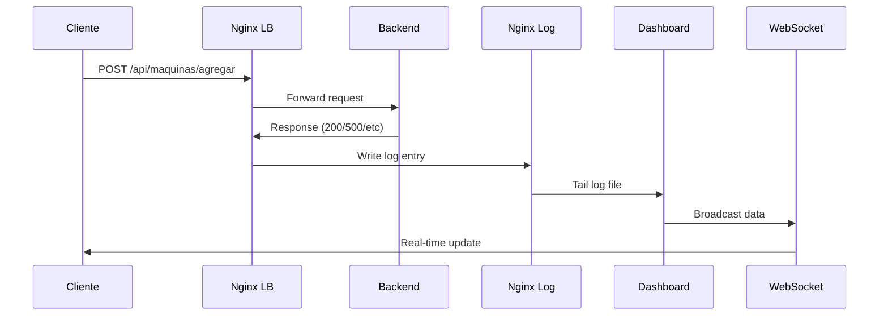

# Dashboard de Monitoreo SIGLAB

## 📋 Descripción
Dashboard en tiempo real para monitorear el balanceo de carga y rendimiento del sistema SIGLAB. Visualiza la distribución de peticiones entre los backends con WebSockets nativos.

## 🎯 Características Principales

- **Monitoreo en Tiempo Real**: Visualización instantánea de carga
- **WebSockets Nativos**: Conexión eficiente sin overhead
- **Auto-Reset**: Limpieza automática después de 7s de inactividad
- **Detección Dinámica**: Reconocimiento automático de nuevos servidores
- **Alertas Visuales**: Indicadores de errores HTTP
- **Integración Nginx**: Lectura directa de logs de balanceo

## 🏗️ Arquitectura del Dashboard

```
┌─────────────────────────────────────────────────────────┐
│                    Dashboard Layer                      │
├─────────────────────────────────────────────────────────┤
│  ┌─────────────┐  ┌─────────────┐  ┌─────────────┐     │
│  │   Frontend  │  │  WebSocket  │  │   Log       │     │
│  │  (Chart.js) │  │   Server    │  │  Monitor    │     │
│  │   :18081    │  │   :8001     │  │  (Tail)     │     │
│  └─────────────┘  └─────────────┘  └─────────────┘     │
└─────────────────────────────────────────────────────────┘
                           │
              ┌────────────┼────────────┐
              │            │            │
    ┌─────────▼───┐ ┌──────▼──────┐ ┌───▼─────────┐
    │   Nginx     │ │  Backends   │ │   MongoDB   │
    │ Load Bal.   │ │  (FastAPI)  │ │  (Logs)     │
    │   :8888     │ │  :8000 x3   │ │   :27018    │
    └─────────────┘ └─────────────┘ └─────────────┘
```

## 🛠️ Stack Tecnológico

### Backend del Dashboard
- **Python 3.11**: Lenguaje principal
- **aiohttp**: Framework web asíncrono
- **WebSockets**: RFC 6455 nativos
- **asyncio**: Programación asíncrona
- **Regex**: Parseo de logs Nginx

### Frontend del Dashboard
- **HTML5**: Estructura semántica
- **Chart.js**: Visualización de datos
- **JavaScript ES6+**: Lógica asíncrona
- **WebSocket API**: Conexión en tiempo real

### Integración
- **Nginx Logs**: Monitoreo de `/var/log/nginx/balanceo_siglab.log`
- **Docker Volumes**: Compartir logs entre contenedores
- **Health Checks**: Monitoreo de salud del dashboard

## 📁 Estructura del Proyecto

```
dashboard/
├── server.py                 # Servidor principal aiohttp
├── index.html               # Interfaz web del dashboard
├── requirements.txt         # Dependencias Python
├── Dockerfile              # Imagen Docker del dashboard
├── .dockerignore           # Exclusiones Docker
└── README.md               # Esta documentación
```

## 🚀 Funcionamiento del Sistema

### 1. Flujo de Monitoreo



### 2. Proceso de Datos

```python
# server.py - Core logic
async def monitor_nginx_logs():
    """Monitorea logs de Nginx en tiempo real"""
    cmd = ['tail', '-f', '/var/log/nginx/balanceo_siglab.log']
    
    async with aiohttp.ClientSession() as session:
        proc = await asyncio.create_subprocess_exec(
            *cmd,
            stdout=asyncio.subprocess.PIPE,
            stderr=asyncio.subprocess.DEVNULL
        )
        
        async for line in proc.stdout:
            log_entry = line.decode().strip()
            parsed_data = parse_nginx_log(log_entry)
            
            if parsed_data and parsed_data['status'] == 200:
                await broadcast_to_websockets(parsed_data)
```

### 3. Formato de Logs Nginx

```nginx
# nginx.conf - Log format personalizado
log_format balanceo_siglab '$upstream_addr - $remote_user [$time_local] '
                          '"$request" $status $body_bytes_sent '
                          '"$http_referer" "$http_user_agent"';

# Ejemplo de entrada de log
172.20.0.3:8000 - - [16/Feb/2026:18:30:45 +0000] 
"POST /api/maquinas/agregar HTTP/1.1" 200 156 
"http://localhost:18080" "Mozilla/5.0..."
```

## 🔧 Configuración Detallada

### 1. Servidor aiohttp

```python
# server.py - Configuración principal
from aiohttp import web, WSMsgType
import asyncio
import json
import re

async def websocket_handler(request):
    """Maneja conexiones WebSocket"""
    ws = web.WebSocketResponse()
    await ws.prepare(request)
    
    # Agregar a lista de conexiones activas
    connected_clients.add(ws)
    
    try:
        async for msg in ws:
            if msg.type == WSMsgType.TEXT:
                # Echo para mantener conexión viva
                await ws.send_str('pong')
            elif msg.type == WSMsgType.ERROR:
                print(f'WebSocket error: {ws.exception()}')
    finally:
        connected_clients.remove(ws)
    
    return ws

async def broadcast_to_websockets(data):
    """Envía datos a todos los clientes conectados"""
    if connected_clients:
        message = json.dumps(data)
        await asyncio.gather(
            *[ws.send_str(message) for ws in connected_clients],
            return_exceptions=True
        )
```

### 2. Parseo de Logs

```python
# server.py - Regex para parseo
LOG_PATTERN = re.compile(
    r'(?P<upstream_addr>[\d\.]+:\d+) - '
    r'(?P<remote_user>\S+) \['
    r'(?P<timestamp>[^\]]+)\] '
    r'"(?P<request>[^"]*)" '
    r'(?P<status>\d+) '
    r'(?P<body_bytes_sent>\d+) '
    r'"(?P<http_referer>[^"]*)" '
    r'"(?P<http_user_agent>[^"]*)"'
)

def parse_nginx_log(log_line):
    """Parsea una línea de log de Nginx"""
    match = LOG_PATTERN.match(log_line)
    if not match:
        return None
    
    data = match.groupdict()
    
    # Mapear IP a nombre de servidor
    server_name = map_ip_to_server(data['upstream_addr'])
    
    return {
        'server': server_name,
        'ip': data['upstream_addr'],
        'status': int(data['status']),
        'timestamp': data['timestamp'],
        'request': data['request']
    }

def map_ip_to_server(ip_addr):
    """Mapea dirección IP a nombre legible"""
    server_mapping = {
        '172.20.0.3:8000': 'Server_1',
        '172.20.0.4:8000': 'Server_2', 
        '172.20.0.5:8000': 'Server_3'
    }
    return server_mapping.get(ip_addr, f'Unknown_{ip_addr}')
```

### 3. Frontend Chart.js

```javascript
// index.html - Configuración del gráfico
const ctx = document.getElementById('loadChart').getContext('2d');
const loadChart = new Chart(ctx, {
    type: 'bar',
    data: {
        labels: [], // Se llena dinámicamente
        datasets: [{
            label: 'Requests OK',
            data: [],
            backgroundColor: '#3b82f6',
            borderColor: '#2563eb',
            borderWidth: 2
        }]
    },
    options: {
        responsive: true,
        animation: {
            duration: 300 // Animación rápida
        },
        scales: {
            y: {
                beginAtZero: true,
                ticks: {
                    stepSize: 1
                }
            }
        },
        plugins: {
            legend: {
                display: false // Sin leyenda
            },
            title: {
                display: true,
                text: 'TOTAL REQUESTS OK',
                font: {
                    size: 16,
                    weight: 'bold'
                }
            }
        }
    }
});

// WebSocket connection
const ws = new WebSocket('ws://localhost:18081/ws');

ws.onmessage = function(event) {
    const data = JSON.parse(event.data);
    updateChart(data);
};

function updateChart(data) {
    const { server, status } = data;
    
    if (status !== 200) {
        // Marcar error visualmente
        showErrorIndicator(server);
        return;
    }
    
    // Actualizar o añadir servidor
    let index = loadChart.data.labels.indexOf(server);
    if (index === -1) {
        loadChart.data.labels.push(server);
        loadChart.data.datasets[0].data.push(0);
        index = loadChart.data.labels.length - 1;
    }
    
    // Incrementar contador
    loadChart.data.datasets[0].data[index]++;
    loadChart.update('none'); // Sin animación para updates frecuentes
    
    // Resetear timer de auto-reset
    resetAutoResetTimer();
}
```

## 🚀 Despliegue y Ejecución

### 1. Configuración Docker

```dockerfile
# Dockerfile
FROM python:3.11-slim

WORKDIR /app

# Instalar dependencias
COPY requirements.txt .
RUN pip install --no-cache-dir -r requirements.txt

# Copiar código
COPY server.py index.html ./

# Exponer puertos
EXPOSE 18081 8001

# Comando de ejecución
CMD ["python", "server.py"]
```

### 2. Docker Compose Integration

```yaml
# docker-compose.yml - Dashboard service
dashboard:
  build:
    context: ./dashboard
    dockerfile: Dockerfile
  container_name: siglab_dashboard
  restart: always
  ports:
    - "18081:18081"  # HTTP para frontend
    - "8001:8001"    # WebSocket nativo
  depends_on:
    nginx:
      condition: service_started
  volumes:
    - nginx_logs:/var/log/nginx:ro  # Leer logs de nginx (solo lectura)
  networks:
    - siglab_network
  healthcheck:
    test: ["CMD-SHELL", "curl -f http://localhost:18081 || exit 1"]
    interval: 30s
    timeout: 10s
    retries: 3
    start_period: 15s
  profiles:
    - all
```

### 3. Ejecución del Sistema

```bash
# Iniciar todos los servicios incluyendo dashboard
docker-compose --profile all up -d

# Verificar estado del dashboard
docker-compose ps dashboard

# Ver logs del dashboard
docker-compose logs -f dashboard

# Verificar conexión WebSocket
curl -i -N -H "Connection: Upgrade" \
     -H "Upgrade: websocket" \
     -H "Sec-WebSocket-Key: test" \
     -H "Sec-WebSocket-Version: 13" \
     http://localhost:18081/ws
```

## 📊 Visualización y Monitoreo

### 1. Interfaz Principal

- **Gráfico de Barras**: Muestra requests por servidor
- **Contadores Numéricos**: Total de requests OK
- **Indicadores de Error**: Barras rojas para HTTP no-2xx
- **Auto-Reset**: Limpieza después de 7s inactividad

### 2. Características de UI

```html
<!-- index.html - Estructura principal -->
<!DOCTYPE html>
<html lang="es">
<head>
    <meta charset="UTF-8">
    <meta name="viewport" content="width=device-width, initial-scale=1.0">
    <title>SIGLAB Dashboard</title>
    <script src="https://cdn.jsdelivr.net/npm/chart.js"></script>
    <style>
        body {
            font-family: -apple-system, BlinkMacSystemFont, 'Segoe UI', Roboto;
            margin: 0;
            padding: 20px;
            background: #f8fafc;
        }
        .dashboard-container {
            max-width: 1200px;
            margin: 0 auto;
            background: white;
            border-radius: 12px;
            padding: 24px;
            box-shadow: 0 4px 6px -1px rgba(0, 0, 0, 0.1);
        }
        .status-indicator {
            display: inline-block;
            width: 12px;
            height: 12px;
            border-radius: 50%;
            margin-right: 8px;
        }
        .status-ok { background: #10b981; }
        .status-error { background: #ef4444; }
        .auto-reset-timer {
            font-size: 14px;
            color: #64748b;
            margin-top: 16px;
        }
    </style>
</head>
<body>
    <div class="dashboard-container">
        <header>
            <h1>SIGLAB Load Balancer Dashboard</h1>
            <div>
                <span class="status-indicator status-ok"></span>
                <span id="connection-status">Connected</span>
            </div>
        </header>
        
        <main>
            <canvas id="loadChart" width="400" height="200"></canvas>
            <div class="auto-reset-timer" id="auto-reset">
                Auto-reset in: 7s
            </div>
        </main>
    </div>
</body>
</html>
```

### 3. Estados y Condiciones

```javascript
// index.html - Manejo de estados
let autoResetTimer = null;
let autoResetCountdown = 7;

function resetAutoResetTimer() {
    // Limpiar timer existente
    if (autoResetTimer) {
        clearTimeout(autoResetTimer);
    }
    
    // Resetear contador
    autoResetCountdown = 7;
    updateAutoResetDisplay();
    
    // Iniciar nuevo timer
    autoResetTimer = setInterval(() => {
        autoResetCountdown--;
        updateAutoResetDisplay();
        
        if (autoResetCountdown <= 0) {
            resetChart();
            clearInterval(autoResetTimer);
        }
    }, 1000);
}

function resetChart() {
    loadChart.data.labels = [];
    loadChart.data.datasets[0].data = [];
    loadChart.update();
}

function showErrorIndicator(server) {
    // Implementar indicador visual de error
    const index = loadChart.data.labels.indexOf(server);
    if (index !== -1) {
        loadChart.data.datasets[0].backgroundColor[index] = '#ef4444';
        loadChart.update();
        
        // Resetear color después de 2s
        setTimeout(() => {
            loadChart.data.datasets[0].backgroundColor[index] = '#3b82f6';
            loadChart.update();
        }, 2000);
    }
}
```

## 🔧 Configuración Avanzada

### 1. Personalización de Logs Nginx

```nginx
# nginx.conf - Configuración optimizada para dashboard
upstream maquinas_backend {
    server pp1_01-backend-1:8000 weight=3 max_fails=1 fail_timeout=5s;
    server pp1_01-backend-2:8000 weight=2 max_fails=1 fail_timeout=5s;
    server pp1_01-backend-3:8000 weight=3 max_fails=1 fail_timeout=5s;
    keepalive 32;
}

server {
    listen 80;
    
    # Log personalizado para el dashboard
    access_log /var/log/nginx/balanceo_siglab.log balanceo_siglab;
    
    location /api/maquinas/agregar {
        proxy_pass http://maquinas_backend;
        proxy_set_header Host $host;
        proxy_set_header X-Real-IP $remote_addr;
        proxy_set_header X-Forwarded-For $proxy_add_x_forwarded_for;
        proxy_set_header X-Forwarded-Proto $scheme;
        
        # Headers adicionales para tracking
        add_header X-Upstream-Addr $upstream_addr always;
        add_header X-Upstream-Status $upstream_status always;
    }
}
```

### 2. Variables de Entorno

```bash
# .env dashboard
DASHBOARD_HOST=0.0.0.0
DASHBOARD_PORT=18081
WEBSOCKET_PORT=8001
LOG_FILE_PATH=/var/log/nginx/balanceo_siglab.log
AUTO_RESET_SECONDS=7
UPDATE_INTERVAL_MS=100
MAX_CONNECTIONS=100
```

### 3. Monitoreo de Salud

```python
# server.py - Health check endpoint
async def health_check(request):
    """Endpoint de salud del dashboard"""
    status = {
        'status': 'healthy',
        'timestamp': datetime.utcnow().isoformat(),
        'websocket_connections': len(connected_clients),
        'nginx_log_accessible': os.path.exists('/var/log/nginx/balanceo_siglab.log'),
        'uptime_seconds': time.time() - start_time
    }
    return web.json_response(status)

# Rutas de la aplicación
app = web.Application()
app.router.add_get('/', serve_index)
app.router.add_get('/ws', websocket_handler)
app.router.add_get('/health', health_check)
app.router.add_static('/', path='.', name='static')
```

## 🚨 Troubleshooting

### Problemas Comunes

#### 1. WebSocket no conecta
```bash
# Verificar que el dashboard esté corriendo
curl http://localhost:18081/health

# Verificar logs del dashboard
docker-compose logs dashboard | grep -i websocket

# Probar conexión manual
wscat -c ws://localhost:18081/ws
```

#### 2. No se muestran datos
```bash
# Verificar logs de Nginx
docker exec nginx_balancer tail -f /var/log/nginx/balanceo_siglab.log

# Generar tráfico de prueba
curl -X POST http://localhost:8888/api/maquinas/agregar \
     -H "Content-Type: application/json" \
     -d '{"nombre":"test","tipo":"Computadora","estado":"Operativa","ubicacion":"Lab A"}'

# Verificar permisos de lectura
docker exec siglab_dashboard ls -la /var/log/nginx/
```

#### 3. Alto uso de CPU
```bash
# Monitorear recursos
docker stats siglab_dashboard

# Optimizar regex y parseo
# Usar compilación de regex una sola vez
LOG_PATTERN = re.compile(pattern, re.MULTILINE)

# Reducir frecuencia de actualizaciones
UPDATE_INTERVAL_MS = 500  # En lugar de 100ms
```

### Debug Mode

```python
# server.py - Modo debug
DEBUG = os.environ.get('DEBUG', 'false').lower() == 'true'

if DEBUG:
    logging.basicConfig(level=logging.DEBUG)
    print(f"Debug mode enabled")
    print(f"Log file: {LOG_FILE_PATH}")
    print(f"WebSocket port: {WEBSOCKET_PORT}")
```

## 📈 Métricas y Monitoreo

### 1. Métricas del Dashboard

```python
# server.py - Métricas internas
class DashboardMetrics:
    def __init__(self):
        self.total_requests = 0
        self.error_requests = 0
        self.servers_seen = set()
        self.start_time = time.time()
    
    def record_request(self, server, status):
        self.total_requests += 1
        self.servers_seen.add(server)
        
        if status >= 400:
            self.error_requests += 1
    
    def get_metrics(self):
        uptime = time.time() - self.start_time
        return {
            'total_requests': self.total_requests,
            'error_rate': self.error_requests / max(self.total_requests, 1),
            'unique_servers': len(self.servers_seen),
            'uptime_seconds': uptime,
            'requests_per_second': self.total_requests / max(uptime, 1)
        }

metrics = DashboardMetrics()
```

### 2. Endpoints de Monitoreo

```python
# server.py - API de métricas
async def metrics_endpoint(request):
    """Retorna métricas del dashboard"""
    return web.json_response(metrics.get_metrics())

async def servers_endpoint(request):
    """Retorna lista de servidores activos"""
    servers = list(metrics.servers_seen)
    return web.json_response({'servers': sorted(servers)})
```

## 🔄 Mejoras Futuras

### 1. Características Planificadas

- **Histórico de Datos**: Persistencia en MongoDB
- **Alertas Avanzadas**: Slack/Email notifications
- **Múltiples Algoritmos**: Comparación de balanceo
- **Exportación de Datos**: CSV/JSON/PDF reports
- **Autenticación**: Acceso seguro al dashboard

### 2. Optimizaciones

- **Web Workers**: Procesamiento en background
- **Virtual Scrolling**: Para muchos servidores
- **Caching de Logs**: Buffer de lecturas
- **Compression**: WebSocket message compression

---

**Versión**: 2.0.0  
**Estado**: Producción  
**Última Actualización**: 2026  
**Arquitectura**: WebSocket + aiohttp
